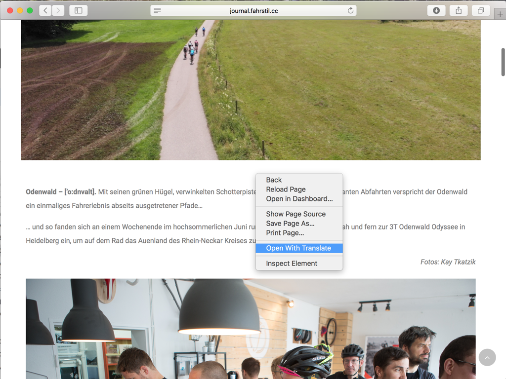

# Open With Translate

Open With Translate is a Safari extension that gives you an easy way to translate websites. Just right click on any site and click 'Open With Translate'. A new tab will open with the site translated by Google Translate. Google will automatically detect the language that the site is in and the language that your browser is set to use.

Chrome already has this feature built in, I've always missed having it in Safari. Enjoy!

